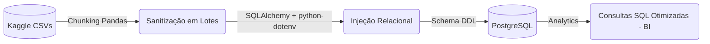

<h1 align="center">
  📦 E-Commerce Data Pipeline (Olist dataset)
</h1>

<p align="center">
  
  
  
</p>

## 📌 Visão Geral do Projeto

Este projeto de **Engenharia de Dados** resolve uma complexidade comum no varejo: cruzar dados transacionais massivos e não-estruturados, garantindo governança, integridade de dados (ACID) e velocidade Analítica no final do funil. 

O script consome os datasets brutos da Olist (Kaggle), trata inconsistências em tempo de execução via Python, e carrega estruturalmente em um *Data Warehouse* em PostgreSQL. Tudo isolado por variáveis de ambiente seguras (`.env`) e modelado via DDL.

## 🏗️ Arquitetura do Pipeline



## 🧠 Insights de Engenharia: O Que Aprendemos Construindo Esse Pipeline?

Desenvolver este projeto evidenciou o abismo entre um script amador e uma infraestrutura resiliente de dados. As principais lições e saltos de arquitetura tomados foram:

1. **Gestão de Memória *(OOM Killer Prevention)*:** Carregar 15 milhões de linhas de uma vez na RAM e mandar o Pandas injetar derruba qualquer cluster pequeno de Cloud. A implementação de `chunksize` no `read_csv` garantiu que o pipeline pudesse processar gigabytes consumindo apenas alguns megabytes constantes de memória lendo lotes independentes.
2. **Ordem de Inserção e Integridade (DB Constraints):** Ferramentas como o Pandas tendem a usar o modo de injeção destrutivo (`replace`), matando as chaves do banco de dados (Primary Keys / Foreign Keys). Aprendemos a priorizar o DDL (`01_schema.sql`) para travar as regras de negócio no banco (ex: um pedido não pode ser criado se o remetente não existe) e a mandar o Python obedecer essas regras usando Ingestão Segura via modo `append` na ordem exata ditada pelo modelo relacional.
3. **Isolamento de Segurança (`.env`):** Hardcodar senhas no código é banimento imediato em equipes ágeis. Retirar configurações sensíveis e gerenciar conexões JDBC/ODBC através de variáveis de ambiente separadas do repositório garante portabilidade de instâncias DEV, QA e PROD.

---

## 📊 Impacto de Negócio: Insights & Propostas de Solução
O arquivo `02_analysis.sql` entrega alto valor para o corpo diretor (*C-level*). Contudo, análise de dados é vazia sem planos de ação. Eis os gargalos diagnosticados e suas resoluções estruturais sugeridas:

**1. Colapso Logístico Regional:**
- **Problema Diagnosticado:** Há um atraso sistêmico latente — excedendo +48 dias o SLA estimado de entrega para a base de consumidores residentes no Extremo Norte e Nordeste. 
- **Plano de Solução (Proposta):** Restringir organicamente contratos com a principal transportadora para esta rota de longa distância, operando parcerias de frete *Last-Mile* intermunicipais; e priorizar isenção/estímulo tributário para angariar *Sellers* locais destas macrorregiões para atuarem como polos distribuidores encurtando a malha aérea.

**2. Sustentação Desigual do Faturamento Bruto (GMV):**
- **Problema Diagnosticado:** Observamos matematicamente que as poucas linhas atreladas à "Beleza/Saúde" e "Cama/Mesa/Banho" respondem pelo tracionamento e mascaram prejuízos latentes das demais prateleiras (cauda longa).
- **Plano de Solução (Proposta):** Implementação de estratégias de *Cross-Selling*. Podemos amarrar recomendações automáticas de compras conjuntas (ex: O usuário vai comprar algo do setor "Esporte" que traz baixa margem, o carrinho recomenda instantaneamente uma linha de Suplementação Ativa que vem da vertical hiper-lucrativa de Beleza/Saúde). Fortalecendo a volumetria integral.

---

### 💻 Como Reproduzir

**1. Dependências Local:** 
Tenha o Python 3.x e o PostgreSQL rodando localmente (porta `5432`). 

**2. Setup do Repositório:**
```bash
git clone https://github.com/Cavalchi/Pipeline-de-Vendas-E-commerce.git
cd Pipeline-de-Vendas-E-commerce
pip install -r requirements.txt
```

**3. Autenticação:**
Crie o arquivo `.env` na raiz do repositório contendo as variáveis exigidas para conexão segura:
```env
DB_USER=postgres
DB_PASS=SUA_SENHA_AQUI
DB_HOST=localhost
DB_PORT=5432
DB_NAME=postgres
```

**4. DDL & Setup Relacional:**
Rode o script em `sql/01_schema.sql` no seu SGDB para moldar o Data Warehouse com suas Constraints vitais.

**5. Ingestão:**
Faça o download dos relatórios oficiais em CSV da Olist (no Kaggle), deposite dentro de `data/raw/` e execute o processamento particionado:
```bash
python src/ingestion/etl_olist.py
```
